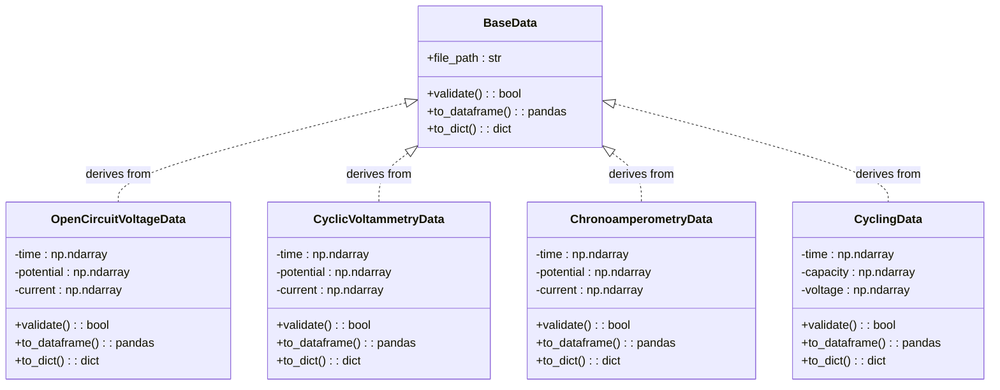
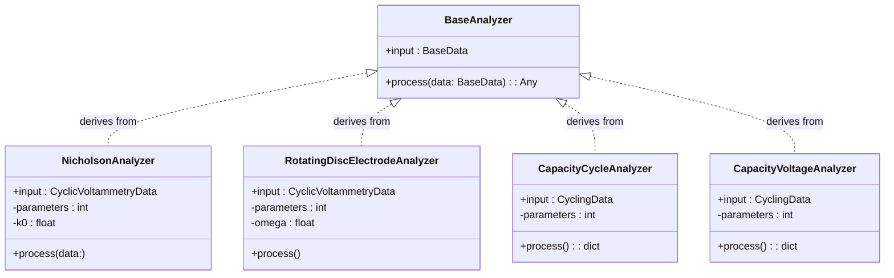
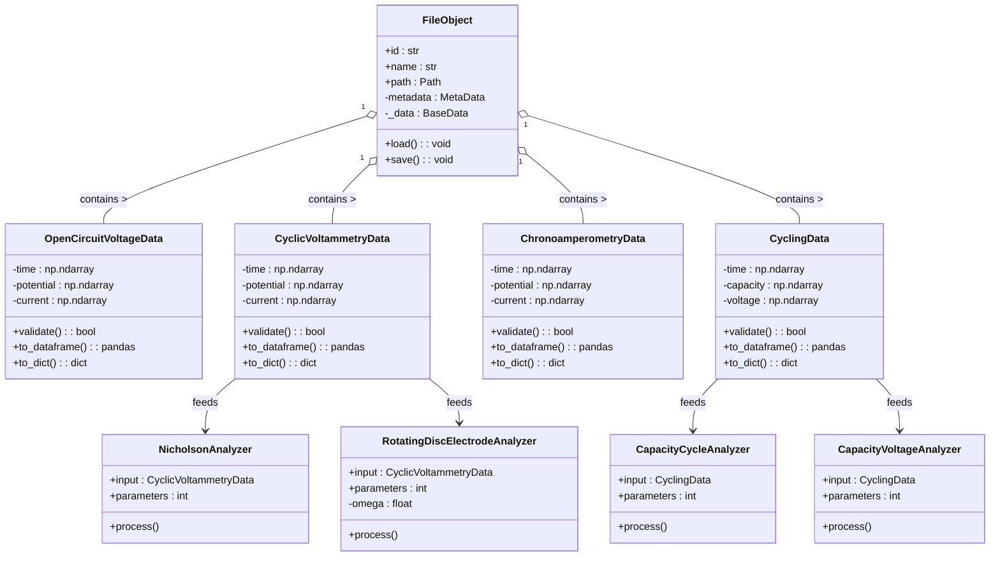

## `BaseData` class and child classes

We so far defined the metadata format in a flexible way applicable to different experimental setups and techniques. Now, we need to define the raw data formats for each electrochemical measurement methods, we want to support. 

**Problem:**

- Each measurement method has it's own set of data variables, which are required for proper evaluation of the data

**Objective**

- Define modular data structures in the code, which define the raw data format required for each measurement method (and allows easy implementation of new m in the future)
- Only implement the minimal dataset needed to get all data variables (i.e., don't save data we can calculate "on-the-fly" like capacity data)

**Proposal**

- Implement a `BaseData`-class as `@dataclass`, which defines the basic structure and methods of technique/auxiliary data objects. 
- Implement childs of this class, which define the raw data format of specific measurement methods (e.g., `OpenCircuitVoltageData`, `CyclicVoltammetryData`, `ChronoamperometryData`, `CyclingData`, ...)
- Each `...Data`-Object will hold the raw data of a specific technique and will be linkable to a `FileObject` (e.g., by `FileObject._data = CyclingData()`).
- Each `...Data`-Object might have methods to validate data integrity, output the data in different formats, etc. 

> #### Abstraction is important
> 
> We should think from the perspective of the data and not from the perspective of the evaluation. 
> 
> **What does that mean?**
> 
> I think we should strictly **separate the classes holding the data** and **the classes for data evaluation**. This should give us the flexibility to implement different types of analyzers which can be applied to dataset. For example, `CyclicVoltammetryData` could contain normal CV data or RDE data. So, we treat both the same on the data level, but have different analyzers to get out what we want.
> 
> **What are these analyzers then?**
> 
> Analyzers would be separate classes/objects that can take one or multiple `...Data`-object as input and process/plot the data in a defined way. So, for example, there could be a `NicholsonAnalyzer` to evaluate the kinetic parameters from a set of `CyclicVoltammetryData`-objects. But there could also be a `RotatingDiscElectrodeAnalyzer`, which would be capable of applying standard RDE-evaluation on a set of `CyclicVoltammetryData`-objects.

## Visualisation

**Scheme 1:** `BaseData` is the abstract class definition for all specific raw data we want to digest from the different electrochemical techniques.

**Scheme 2:** `BaseAnalyzer` is the abstract class definition for all analyzers we want to implement. Each analyzer has a specific purpose (e.g., evaluating the battery capacity over time/cycle, etc.). Each analyzer can take one or multiple `...Data`-objects as input.

**Scheme 3:** The overall structure of information flow between the `File`, `Data`, and `Analyzer` classes / modules. 

## Future extensions

- We and other users will be able to define there own analyzers based on `BaseAnalyzer` to implement there own analysis techniques
- `Analyzer` will be able to produce there own `Data`-Classes, which may contain the data resulting from the analysis