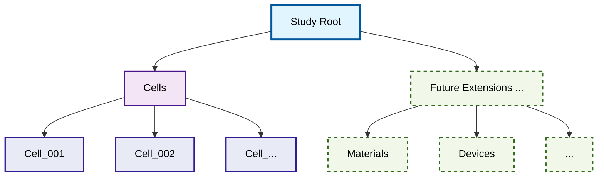
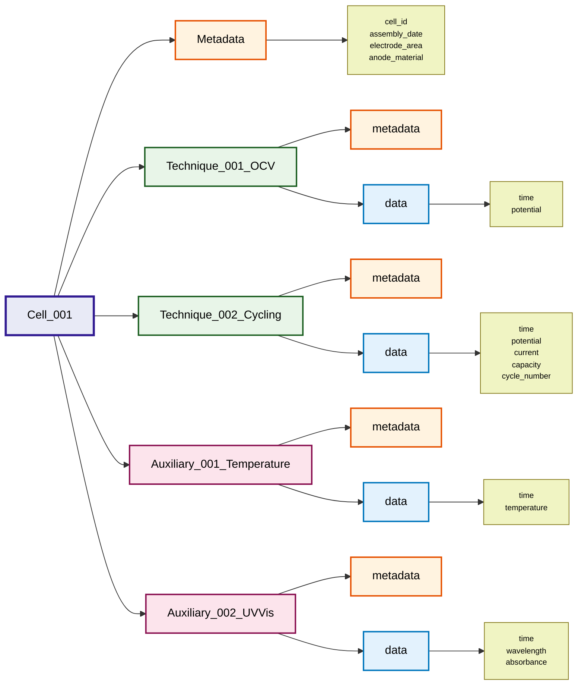

# NetCDF File Format Specification for Electrochemical Data

This document defines the hierarchical netCDF file format for storing electrochemical data, based on a systematic approach that captures experimental metadata, cell configurations, and technique sequences.

## Overview

The file format follows a hierarchical structure designed to maintain the relationship between physical electrochemical experiments and their data:

```
Study (Root)
├── Metadata (study description, etc.)
├── Cells/
│   ├── Cell 1
│   │   ├── Metadata (cell setup, configuration, etc.)
│   │   ├── Technique 1 (OCV, chronoamperometry, etc.)
│   │   ├── Technique 2
│   │   ├── ...
│   │   ├── Auxiliary 1 (temperature, pressure, UV/Vis data, etc.)
│   │   └── Auxiliary 2
│   │   └── ...
│   ├── Cell 2
│   │   ├── Metadata
│   │   ├── Technique 1 
│   │   ├── Technique 2
│   │   ├── ...
│   │   ├── Auxiliary 1
│   │   └── Auxiliary 2
│   │   └── ...
│   └── ...
└── [Optional Future Extensions]
    ├── Materials
    ├── Devices
    ├── Calibration Data
    └── ...
```

## Hierarchical Structure

### 1. Study Level (Root Group)
The root group represents a complete electrochemical study and contains:
- **File metadata**: Creation date, echem_data_tool version, data format version
- **Global metadata**: Study name, date, operator, laboratory conditions
- **Cells group**: Container for all electrochemical cells
- **Future extension groups**: Space for additional top-level data types, if ever required

### 2. Cells Level (Container Group)
The cells group serves as a container for all electrochemical cells and provides:
- **Organizational structure**: Clear separation of cells from other potential data
- **Scalability**: Easy addition of new cells without cluttering root level
- **Future-proofing**: Allows for other top-level groups (materials, devices, etc.)

### 3. Cell Level (Subgroups within Cells)
Each cell group represents a physical electrochemical cell and contains:
- **Cell metadata**: Cell configuration, electrode materials, electrolyte, geometry
- **Technique groups**: Sequential electrochemical measurements
- **Auxiliary data groups**: Parallel time series data (temperature, spectroscopy, etc.)

### 4. Technique Level (Subgroups within Cell)
Each technique group represents a specific electrochemical measurement and contains:
- **Technique metadata**: Method parameters, start/end time, sequence number
- **Data subgroup**: Contains all time series data (current, potential, capacity, etc.)

### 5. Auxiliary Data (Groups within Cell)
Additional time series data recorded in parallel with electrochemical measurements:
- **Auxiliary metadata**: Data type, timing, measurement parameters
- **Data subgroup**: Contains all time series variables for the auxiliary measurement

## Structure Visualization

### Overall Hierarchy


### Cell Structure Detail


## NetCDF Groups and Variables Mapping

### File Structure with Naming Conventions
```
/                                   # Root group (Study)
├── metadata                        # Global attributes
├── cells/                          # Cells container group
│   ├── cell_001/                   # Cell group
│   │   ├── metadata                # Cell group attributes
│   │   ├── technique_001_OCV/      # Technique subgroup
│   │   │   ├── metadata            # Technique attributes  
│   │   │   └── data/               # Data subgroup
│   │   │       ├── time            # Data variable
│   │   │       └── potential       # Data variable
│   │   ├── technique_002_cycling/   # Next technique
│   │   │   ├── metadata
│   │   │   └── data/
│   │   │       ├── time
│   │   │       ├── potential
│   │   │       ├── current
│   │   │       ├── capacity
│   │   │       └── cycle_number
│   │   ├── auxiliary_001_temperature/ # Auxiliary time series
│   │   │   ├── metadata
│   │   │   └── data/
│   │   │       ├── time
│   │   │       └── temperature
│   │   ├── auxiliary_002_UVVis/     # Another auxiliary measurement
│   │   │   ├── metadata
│   │   │   └── data/
│   │   │       ├── time
│   │   │       ├── wavelength
│   │   │       └── absorbance
│   │   └── auxiliary_XXX_YYYY/      # Additional auxiliary data
│   ├── cell_002/                   # Second cell ...
│   └── ...                         # Additional cells ...
└── [future_extensions]/            # Future top-level groups
    ├── materials/                  # Material data
    ├── devices/                    # Device data
    └── .../                        # ...
```

### Group Naming Conventions
- **Root group**: Contains study-level metadata
- **Cells group**: Named as `cells` - contains all cell subgroups
- **Cell groups**: Named as `cell_XXX` where XXX is a zero-padded number (001, 002, ...)
- **Technique groups**: Named as `technique_XXX_YYYY` where:
  - XXX is the sequence number (001, 002, ...)
  - YYYY is the technique type (OCV, cycling, CV, EIS, etc.)
- **Auxiliary data groups**: Named as `auxiliary_XXX_YYYY` where:
  - XXX is the sequence number (001, 002, ...)
  - YYYY is the data type (temperature, UVVis, pressure, etc.)
- **Data subgroups**: Named as `data` within each technique and auxiliary group
- **Future extensions**: Reserved namespace for additional top-level groups

## Metadata Schemas

The file format uses a hierarchical metadata structure with NetCDF attributes defined at each level. NetCDF attributes support primitive data types (strings, integers, floats, arrays) and are stored as key-value pairs within groups. All attributes are technically optional in NetCDF, but this specification defines mandatory attributes for format compliance.

**Note:** The metadata schemas below are based on the [Battery Data Genome (BDG) approach](ecell_metadata_specs.md) with tier-based organization. However, the metadata are distributed across the hierarchical netCDF structure according to logical grouping principles. The tier classification is documented for each metadata field to maintain BDG compatibility while ensuring logical data organization.

### Study-Level Metadata (Root/Global Attributes)
Global information about the entire study stored as NetCDF attributes. Contains file format metadata and essential study-wide parameters.

**JSON Schema:**
```json
{
  "file_metadata": {
    "format_version": "1.0.0",
    "timestamp": "2025-07-15T08:00:00Z" // creation time of this netCDF file
  },
  "study_metadata": {
    "id": "20250715_AB-EC35-2_1_PFPMAm-co-TEGDMA1,0_Zn_2MZnClO4_RC_data",
    "description": "Investigation of a ferrocene-based polymer",
    "contributors": [
      {
        "name": "Jane Doe",
        "email": "jane.doe@example-university.edu",
        "affiliation": "Example University",
        "additional_info": [ // optional/additional information
          {
            "name": "orcid",
            "value": "https://orcid.org/0000-0000-0000-0000",
          },
          {
            "name": "contribution",
            "value": "Synthesis of polymer",
          }
        ]
      },
      {
        "name": "John Smith",
        "email": "john.smith@example-university.edu",
        "affiliation": "Example University",
        "additional_info": [ // optional/additional information
          {
            "name": "orcid",
            "value": "https://orcid.org/0000-0000-0000-0001",
          },
          {
            "name": "contribution",
            "value": "Study leader / operator",
          }
        ]
      },
      {
        "name": "Alice Johnson",
        "email": "alice.johnson@example-university.edu",
        "affiliation": "Example University",
        "additional_info": [ // optional/additional information
          {
            "name": "orcid",
            "value": "https://orcid.org/0000-0000-0000-0002",
          },
          {
            "name": "contribution",
            "value": "Principal investigator",
          }
        ]
      },
    ],
    "funding": [
      {
        "agency": "National Science Foundation",
        "country": "USA",
        "grant_number": "CHE-2023456",
      },
      {
        "agency": "European Research Council",
        "country": "EU",
        "grant_number": "ERC-2022-STG-101039847",
      },
      {
        "agency": "Example University",
        "country": "USA", 
        "grant_number": "INT-2024-001",
      }
    ]
  }
}
```

### Cell-Level Metadata (Cell Group Attributes)
Physical and configuration details for each electrochemical cell. Contains essential cell identifiers, chemistry, and comprehensive material/physical parameters organized by importance level. The difficulty here is to capture the different aspects of all types of electrochemical cells (e.g., coin cells, flow cells, three-electrode cells, etc.) into one generic JSON schema, which is flexible and yet descriptive.

**JSON Schema:**
```json
{
  "primary": {
    "id": "AB-EC35-2",
    "type": "Three-electrode Swagelok-cell",
    "chemistry": "Zn | Zn(ClO4)2, NH4ClO4 (aq) | Ferrocene | Ag", // use standard nomenclature for electrochemical cells here?
    "nominal_capacity_ah": 0.000127,
    "assembly_timestamp": "2025-07-14T12:13:00Z",
    "assembly_environment": "argon glovebox",
    "eol_timestamp": "2025-07-20T19:50:14Z", // eol = end of life
  },
  "secondary": { // in the ideal case this should cover all different cell types
    "components": [
      {
        "name": "positive_half_cell",
        "materials": [
          {
            "name": "PFPMAm-co-TEGDMA (1%)",
            "type": "active_material",
            "wt_percent": 65 // maybe a "value" and "unit" field would be better to be more flexible (e.g., allows stating masses)?
                             // Or do we need a "properties"/"additional_info"-list for each material as well to capture things like "vendor", etc.?
          },
          {
            "name": "Super P",
            "type": "conductive_additive",
            "wt_percent": 30
          },
          {
            "name": "High viscosity CMC (Sigma Aldrich)",
            "type": "binder",
            "wt_percent": 5
          }
        ],
        "procedures": [ // details on procedures, like manufacturing procedures
          {
            "name": "coating_method",
            "value": "doctor blade",
            "unit": null
          },
          {
            "name": "drying_temperature",
            "value": 80,
            "unit": "°C"
          },
          {
            "name": "drying_time",
            "value": 12,
            "unit": "hours"
          },
          {
            "name": "calendering_pressure",
            "value": 5.0,
            "unit": "MPa"
          },
          {
            "name": "punching_tool",
            "value": "hand puncher",
            "unit": null
          },
          {
            "name": "storage_temperature",
            "value": 25,
            "unit": "°C"
          },
          {
            "name": "storage_duration",
            "value": 100,
            "unit": "d"
          },
        ],
        "properties": [ // physical and chemical properties
          {
            "name": "diameter",
            "value": 0.6,
            "unit": "cm"
          },
          {
            "name": "mass",
            "value": 0.00100,
            "unit": "g"
          }
        ],
      },
      {
        "name": "negative_half_cell",
        "materials": [
          {
            "name": "PFPMAm-co-TEGDMA (1%)",
            "type": "active_material",
            "wt_percent": 65
          },
          {
            "name": "Super P",
            "type": "conductive_additive",
            "wt_percent": 30
          },
          {
            "name": "High viscosity CMC (Sigma Aldrich)",
            "type": "binder",
            "wt_percent": 5
          }
        ],
        "procedures": [ // details on procedures, like manufacturing procedures
          {
            "name": "coating_method",
            "value": "doctor blade",
            "unit": null
          },
          {
            "name": "drying_temperature",
            "value": 80,
            "unit": "°C"
          },
          {
            "name": "drying_time",
            "value": 24,
            "unit": "hours"
          },
          {
            "name": "calendering_pressure",
            "value": 5.0,
            "unit": "MPa"
          },
          {
            "name": "punching_tool",
            "value": "hand puncher",
            "unit": null
          },
          {
            "name": "storage_temperature",
            "value": 25,
            "unit": "°C"
          },
          {
            "name": "storage_duration",
            "value": 2,
            "unit": "d"
          },
        ],
      },
      {
        "name": "reference_electrode",
        "materials": [
          {
            "name": "Silver",
            "type": "wire",
            "wt_percent": 100
          },
        ],
        "procedures": [ // details on procedures, like manufacturing procedures
        ],
        "properties": [
          {
            "name": "length",
            "value": 0.1,
            "unit": "cm"
          },
          {
            "name": "diameter",
            "value": 0.0025,
            "unit": "cm"
          },
        ],
      },
      {
        "name": "separator",
        "materials": [
          {
            "name": "Whatman glass microfiber grade GF/D",
            "type": "",
            "wt_percent": 100
          },
        ],
        "procedures": [ // details on procedures, like manufacturing procedures
          {
            "name": "punching_tool",
            "value": "hand puncher",
            "unit": null
          },
        ],
        "properties": [
          {
            "name": "diameter",
            "value": 1.2,
            "unit": "cm"
          },
        ],
      },
      {
        "name": "electrolyte",
        "materials": [
          {
            "name": "water",
            "type": "solvent",
            "wt_percent": 89.5
          },
          {
            "name": "Zn(ClO4)2",
            "type": "supporting_electrolyte",
            "wt_percent": 10.0
          },
          {
            "name": "NH4ClO4",
            "type": "supporting_electrolyte", 
            "wt_percent": 0.5
          }
        ],
        "procedures": [
          {
            "name": "stirring_time",
            "value": 30,
            "unit": "minutes"
          },
          {
            "name": "filtration",
            "value": "0.22 µm syringe filter",
            "unit": null
          }
        ],
        "properties": [
          {
            "name": "volume_in_cell",
            "value": 0.15,
            "unit": "ml"
          },
          {
            "name": "pH",
            "value": 2.1,
            "unit": null
          },
          {
            "name": "conductivity",
            "value": 45.2,
            "unit": "mS/cm"
          }
        ]
      }
    ]
  },
  "tertiary": {
    "additional_notes": [ // add an arbitrary amount of additional notes with a short title for identification and a note text
      {
        "title": "assembly",
        "text": "Oxygen level in glovebox was higher than usual (100 ppm)"
      },
      {
        "title": "equilibration procedure",
        "text": "Electrode was stored at room temperature for 24h after assembly"
      },
      {
        "title": "postmortem observation",
        "text": "Strong coloration of separator was observed after disassembly."
      },
    ]
  }
}
```

### Technique-Level Metadata (Technique Group Attributes)
Parameters and conditions for each electrochemical measurement. Contains essential measurement details and equipment information.

**JSON Schema:**
```json
{
  "primary": {
    "id": 1, // this number should be unique and will also be used to get the sequence of applied techniques
    "auxilary": "False", // always false for techniques, only true for auxilary data
    "type": "cyclic_voltammetry",
    "start": "2025-07-15T09:30:00Z",
    "end": "2025-07-15T10:15:00Z"
  },
  "secondary": {
    "devices": [
      {
        "name": "VMP-3",
        "type": "potentiostat",
        "manufacturer": "Biologic, France",
        "model": "VMP-3",
        "software": "EC-Lab",
        "software_version": "11.61"
      },
      {
        "name": "Pine AFMSRCE",
        "type": "rotating_disk_electrode",
        "manufacturer": "Pine Research Instrumentation",
        "model": "AFMSRCE",
      }
    ],
    "settings": [ // do we need this or can we rely on the experimental data only?
      {
        "name": "scan_rate",
        "value": 0.050,
        "unit": "V/s"
      },
      {
        "name": "potential_range",
        "value": [-0.8, 0.4],
        "unit": "V"
      },
      {
        "name": "rotation_speed_range",
        "value": [0, 5000],
        "unit": "rpm"
      },
    ]
  },
  "tertiary": {
    "additional_notes": [
      {
        "title": "setup",
        "text": "Initial equilibration period of 300s before measurement start"
      },
      {
        "title": "sparging",
        "text": "The electrolyte was sparged with nitrogen for 10 minutes"
      },
      {
        "title": "blanketing",
        "text": "The electrolyte was blanketed with nitrogen during the measurement"
      }
    ]
  }
}
```

### Auxiliary Data Metadata (Auxiliary Group Attributes)
Information for parallel measurements and monitoring. Contains essential sensor information and synchronization details.

**JSON Schema:**
```json
{
  "primary": {
    "id": 1,
    "auxilary": "True",
    "type": "temperature",
    "start": "2025-07-15T09:30:00Z",
    "end": "2025-07-15T10:15:00Z",
    "parent_techniques": [1, 2]
  },
  "secondary": {
    "devices": [
      {
        "name": "Thermocouple Logger",
        "type": "temperature_sensor",
        "manufacturer": "Omega Engineering",
        "model": "HH309A",
        "software": "Omega Software",
        "software_version": "3.2.1"
      }
    ],
    "settings": [
      {
        "name": "sampling_rate",
        "value": 1.0,
        "unit": "Hz"
      },
      {
        "name": "measurement_range",
        "value": [-200, 850],
        "unit": "°C"
      },
      {
        "name": "resolution",
        "value": 0.1,
        "unit": "°C"
      }
    ]
  },
  "tertiary": {
    "additional_notes": [
      {
        "title": "sensor_placement",
        "text": "Thermocouple placed 2 mm from cell surface"
      },
      {
        "title": "calibration",
        "text": "Sensor calibrated against ice bath (0°C) and boiling water (100°C)"
      }
    ]
  }
}
```
