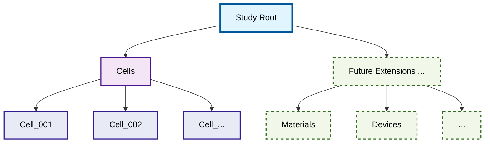
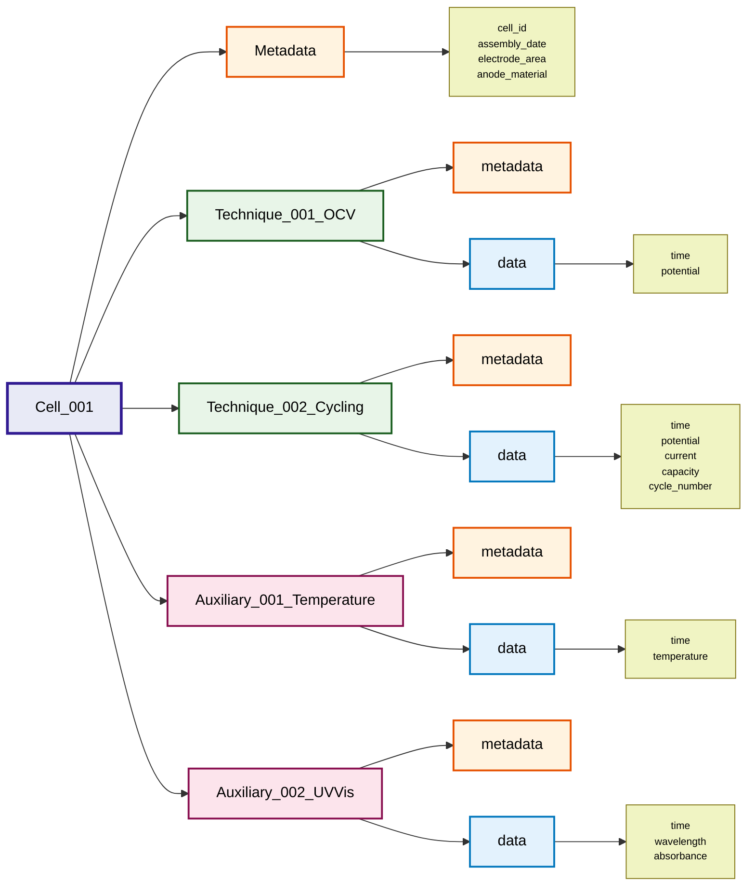

# NetCDF File Format Specification for Electrochemical Data

This document defines the hierarchical netCDF file format for storing electrochemical data, based on a systematic approach that captures experimental metadata, cell configurations, and technique sequences.

## Overview

The file format follows a hierarchical structure designed to maintain the relationship between physical electrochemical experiments and their data:

```
Study (Root)
├── Metadata (study description, etc.)
├── Cells/
│   ├── Cell 1
│   │   ├── Metadata (cell setup, configuration, etc.)
│   │   ├── Technique 1 (OCV, chronoamperometry, etc.)
│   │   ├── Technique 2
│   │   ├── ...
│   │   ├── Auxiliary 1 (temperature, pressure, UV/Vis data, etc.)
│   │   └── Auxiliary 2
│   │   └── ...
│   ├── Cell 2
│   │   ├── Metadata
│   │   ├── Technique 1 
│   │   ├── Technique 2
│   │   ├── ...
│   │   ├── Auxiliary 1
│   │   └── Auxiliary 2
│   │   └── ...
│   └── ...
└── [Optional Future Extensions]
    ├── Materials
    ├── Devices
    ├── Calibration Data
    └── ...
```

## Hierarchical Structure

### 1. Study Level (Root Group)
The root group represents a complete electrochemical study and contains:
- **File metadata**: Creation date, echem_data_tool version, data format version
- **Global metadata**: Study name, date, operator, laboratory conditions
- **Cells group**: Container for all electrochemical cells
- **Future extension groups**: Space for additional top-level data types, if ever required

### 2. Cells Level (Container Group)
The cells group serves as a container for all electrochemical cells and provides:
- **Organizational structure**: Clear separation of cells from other potential data
- **Scalability**: Easy addition of new cells without cluttering root level
- **Future-proofing**: Allows for other top-level groups (materials, devices, etc.)

### 3. Cell Level (Subgroups within Cells)
Each cell group represents a physical electrochemical cell and contains:
- **Cell metadata**: Cell configuration, electrode materials, electrolyte, geometry
- **Technique groups**: Sequential electrochemical measurements
- **Auxiliary data groups**: Parallel time series data (temperature, spectroscopy, etc.)

### 4. Technique Level (Subgroups within Cell)
Each technique group represents a specific electrochemical measurement and contains:
- **Technique metadata**: Method parameters, start/end time, sequence number
- **Data subgroup**: Contains all time series data (current, potential, capacity, etc.)

### 5. Auxiliary Data (Groups within Cell)
Additional time series data recorded in parallel with electrochemical measurements:
- **Auxiliary metadata**: Data type, timing, measurement parameters
- **Data subgroup**: Contains all time series variables for the auxiliary measurement

## Structure Visualization

### Overall Hierarchy


### Cell Structure Detail


## NetCDF Groups and Variables Mapping

### File Structure with Naming Conventions
```
/                                   # Root group (Study)
├── metadata                        # Global attributes
├── cells/                          # Cells container group
│   ├── cell_001/                   # Cell group
│   │   ├── metadata                # Cell group attributes
│   │   ├── technique_001_OCV/      # Technique subgroup
│   │   │   ├── metadata            # Technique attributes  
│   │   │   └── data/               # Data subgroup
│   │   │       ├── time            # Data variable
│   │   │       └── potential       # Data variable
│   │   ├── technique_002_cycling/   # Next technique
│   │   │   ├── metadata
│   │   │   └── data/
│   │   │       ├── time
│   │   │       ├── potential
│   │   │       ├── current
│   │   │       ├── capacity
│   │   │       └── cycle_number
│   │   ├── auxiliary_001_temperature/ # Auxiliary time series
│   │   │   ├── metadata
│   │   │   └── data/
│   │   │       ├── time
│   │   │       └── temperature
│   │   ├── auxiliary_002_UVVis/     # Another auxiliary measurement
│   │   │   ├── metadata
│   │   │   └── data/
│   │   │       ├── time
│   │   │       ├── wavelength
│   │   │       └── absorbance
│   │   └── auxiliary_XXX_YYYY/      # Additional auxiliary data
│   ├── cell_002/                   # Second cell ...
│   └── ...                         # Additional cells ...
└── [future_extensions]/            # Future top-level groups
    ├── materials/                  # Material data
    ├── devices/                    # Device data
    └── .../                        # ...
```

### Group Naming Conventions
- **Root group**: Contains study-level metadata
- **Cells group**: Named as `cells` - contains all cell subgroups
- **Cell groups**: Named as `cell_XXX` where XXX is a zero-padded number (001, 002, ...)
- **Technique groups**: Named as `technique_XXX_YYYY` where:
  - XXX is the sequence number (001, 002, ...)
  - YYYY is the technique type (OCV, cycling, CV, EIS, etc.)
- **Auxiliary data groups**: Named as `auxiliary_XXX_YYYY` where:
  - XXX is the sequence number (001, 002, ...)
  - YYYY is the data type (temperature, UVVis, pressure, etc.)
- **Data subgroups**: Named as `data` within each technique and auxiliary group
- **Future extensions**: Reserved namespace for additional top-level groups

## Metadata Schemas

The file format uses a hierarchical metadata structure with NetCDF attributes defined at each level. NetCDF attributes support primitive data types (strings, integers, floats, arrays) and are stored as key-value pairs within groups. All attributes are technically optional in NetCDF, but this specification defines mandatory attributes for format compliance.

**Note [by CS]:** A common definition of the basic [metadata is under development](ecell_metadata_specs.md). Below are only examples on how to sort and structure the metadata into the file format specification. The level-based metadata is a suggestion, which could make use of the "attributes" in netCDF. Not sure yet, if a simple JSON object at the beginning with all metadata would make more sense.

### Study-Level Metadata (Root/Global Attributes)
Global information about the entire study stored as NetCDF attributes:
- Core identifiers: study name, creation date, format version, operator
- Context information: laboratory, project, ambient conditions
- Extensible for additional study parameters

**NetCDF Attribute Specification:**
```
// Mandatory attributes
title: string                    // Study name
creation_date: string            // ISO 8601 datetime
format_version: string           // Semantic version (e.g., "1.0.0")
creator: string                  // Operator/researcher name(s) (e.g., "Jane Doe, Max Mustermann,...)
...

// Optional attributes  
institution: string              // Laboratory or organization
project: string                  // Associated project name
description: string              // Study description
...
```

### Cell-Level Metadata (Cell Group Attributes)
Physical and configuration details for each electrochemical cell stored as NetCDF attributes:
- Essential properties: cell ID, assembly date, electrode area
- Material descriptions: electrode materials, electrolyte, separator
- Physical parameters: geometry, volume, theoretical capacity
- Open for cell-specific characterization data

**NetCDF Attribute Specification:**
```
// Mandatory attributes
cell_id: string                  // Unique cell identifier
assembly_date: string            // ISO 8601 datetime
...

// Optional attributes - Physical Properties
electrode_area: float            // Active electrode area in cm²
cell_volume: float               // Internal cell volume in mL
theoretical_capacity: float      // Theoretical capacity in mAh
...

// Optional attributes - Materials
anode_material: string           // Anode active material
cathode_material: string         // Cathode active material
electrolyte_composition: string  // Electrolyte description
separator_type: string           // Separator material/type
...

// Optional attributes - Configuration
cell_geometry: string            // Physical cell configuration
assembly_environment: string     // Assembly conditions (e.g., "argon glovebox")
notes: string                    // Additional cell-specific information
...
```

### Technique-Level Metadata (Technique Group Attributes)
Parameters and conditions for each electrochemical measurement stored as NetCDF attributes:
- Core timing: technique type, start/end times, sequence number
- Method parameters: current setpoints, potential ranges, scan rates
- Termination criteria and technique-specific settings
- Flexible structure for emerging electrochemical methods

**NetCDF Attribute Specification:**
```
// Mandatory attributes
sequence_number: int             // Order of execution within cell
technique_type: string           // Measurement technique (e.g., "OCV", "cycling", "CV")
start_time: string               // ISO 8601 datetime
...

// Optional attributes - Timing
end_time: string                 // ISO 8601 datetime
duration: float                  // Technique duration in seconds
...

// Optional attributes - Method Parameters (technique-dependent settings)
scan_rate: float                 // Scan rate in V/s (for CV)
potential_range: float[2]        // [min, max] potential in V
...

// Optional attributes - Equipment
instrument_model: string         // Measurement equipment
channel_number: int              // Instrument channel used
...
```

### Auxiliary Data Metadata (Auxiliary Group Attributes)
Information for parallel measurements and monitoring stored as NetCDF attributes:
- Data identification: measurement type, timing, equipment details
- Calibration and processing parameters
- Synchronization information with electrochemical techniques

**NetCDF Attribute Specification:**
```
// Mandatory attributes
data_type: string                // Type of auxiliary data (e.g., "temperature", "UV-Vis")
start_time: string               // ISO 8601 datetime
...

// Optional attributes - Measurement Info
sensor_model: string             // Sensor/instrument model
sensor_serial: string            // Sensor serial number
measurement_units: string        // Data units (e.g., "°C", "nm")
sampling_rate: float             // Sampling frequency in Hz
...

// Optional attributes - Synchronization
sync_technique: string           // Associated electrochemical technique
time_offset: float               // Time offset relative to technique start in seconds
...
```
